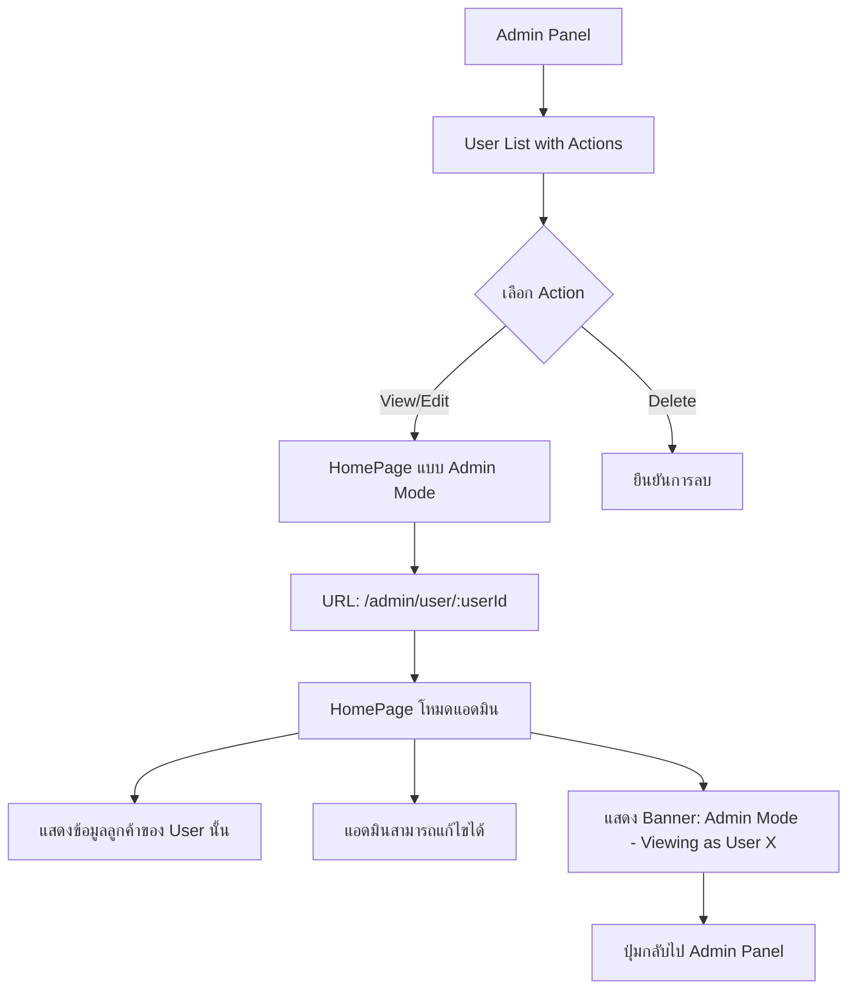

# แผนการพัฒนา: ระบบ Admin User Impersonation

## วัตถุประสงค์

ให้แอดมินสามารถเข้าไปดูและแก้ไขข้อมูลของ user อื่นได้ ผ่านหน้า Admin Panel

## สถาปัตยกรรมระบบ



## รายละเอียดการพัฒนา

### 1. API Endpoints (Backend)

#### 1.1 ปรับปรุง Clients API

- **File:** `server/routes/clients.ts`
- **การเปลี่ยนแปลง:**
  - เพิ่ม query parameter `?userId=` สำหรับแอดมิน
  - ตรวจสอบว่าเป็นแอดมินก่อนอนุญาตให้ดูข้อมูล user อื่น
  - ใช้ middleware ที่รองรับทั้ง user ปกติและแอดมิน

#### 1.2 ปรับปรุง Campaigns API

- **File:** `server/routes/campaigns.ts`
- **การเปลี่ยนแปลง:**
  - อนุญาตให้แอดมินแก้ไขแคมเปญของ user อื่นได้
  - ตรวจสอบสิทธิ์ก่อนการแก้ไข/ลบ

### 2. Frontend Routes

#### 2.1 เพิ่ม Route ใหม่

- **Path:** `/admin/user/:userId`
- **Component:** ใช้ `HomePage` ที่ปรับปรุงแล้ว
- **Props:** `isAdminMode=true`, `targetUserId=userId`

#### 2.2 ปรับปรุง App.tsx

- เพิ่ม route ใหม่สำหรับ admin user view
- ใช้ `AdminRoute` แทน `PrivateRoute` เพื่อตรวจสอบว่าเป็นแอดมิน

### 3. ปรับปรุง Components

#### 3.1 HomePage.tsx

- รับ props: `targetUserId?: number`
- ถ้ามี `targetUserId` ให้ดึงข้อมูลของ user นั้นแทน
- แสดง Banner แจ้งว่ากำลังดูข้อมูลของ user คนอื่น
- แสดงปุ่ม "กลับไปหน้า Admin"

#### 3.2 AdminPage.tsx

- เพิ่มคอลัมน์ "Actions" ในตาราง Users
- เพิ่มปุ่ม "View/Edit" สำหรับแต่ละ user
- นำทางไปยัง `/admin/user/:userId`

### 4. API Layer (Frontend)

#### 4.1 api.ts

- เพิ่ม parameter `userId` ใน `clientsApi.getAll()`
- เพิ่ม parameter `userId` ใน `clientsApi.getOne()`
- อัพเดท `campaignsApi` ให้รองรับการทำงานกับ user อื่น

## โครงสร้างไฟล์ที่ต้องแก้ไข

### Backend

1. `server/routes/clients.ts` - รองรับการดึงข้อมูล user อื่นโดยแอดมิน
2. `server/routes/campaigns.ts` - รองรับการแก้ไขข้อมูล user อื่นโดยแอดมิน
3. `server/middleware/auth.ts` หรือสร้าง `server/middleware/adminOrOwnerAuth.ts`

### Frontend

1. `src/App.tsx` - เพิ่ม route `/admin/user/:userId`
2. `src/pages/HomePage.tsx` - รองรับ admin mode
3. `src/pages/AdminPage.tsx` - เพิ่มปุ่ม View/Edit
4. `src/api/api.ts` - อัพเดท API calls
5. `src/types/index.ts` - เพิ่ม types ที่จำเป็น (ถ้ามี)

## UI/UX Design

### Admin Panel - Users Tab

```
+--------------------------------------------------+
|  User          | Role | Status | Stats | Actions |
+--------------------------------------------------+
|  John Doe      | user | active | 3/5   | [View]  |
|  j@email.com   |      |        |       |         |
+--------------------------------------------------+
|  Jane Smith    | admin| active | 1/2   | (You)   |
|  jane@email.com|      |        |       |         |
+--------------------------------------------------+
```

### HomePage - Admin Mode

```
+--------------------------------------------------+
|  🔴 ADMIN MODE: Viewing as "John Doe"     [Back] |
+--------------------------------------------------+
|                                                  |
|  [Dashboard Stats - ของ John Doe]                |
|                                                  |
|  [Client Cards - ของ John Doe]                   |
|    - แอดมินสามารถ Add/Edit/Delete ได้           |
|                                                  |
+--------------------------------------------------+
```

## Security Considerations

1. **Authentication:** ตรวจสอบ token ทุกครั้ง
2. **Authorization:** ตรวจสอบว่าเป็นแอดมินจริงก่อนอนุญาตให้ดูข้อมูล user อื่น
3. **Audit Trail:** (Optional) บันทึก log เมื่อแอดมินแก้ไขข้อมูล user อื่น
4. **Session:** ไม่ต้องเปลี่ยน session แอดมินยังคงเป็นแอดมินอยู่

## ขั้นตอนการทำงาน

1. แอดมินเข้าหน้า Admin Panel
2. แอดมินเลือก tab "Users"
3. แอดมินกดปุ่ม "View/Edit" ที่ user ที่ต้องการ
4. ระบบนำทางไป `/admin/user/:userId`
5. หน้า HomePage โหลดข้อมูลของ user นั้น
6. แอดมินสามารถดูและแก้ไขข้อมูลได้เหมือนเป็น user นั้น
7. แอดมินกด "Back to Admin" เพื่อกลับไปหน้า Admin Panel

## หมายเหตุ

- แอดมินไม่สามารถแก้ไขข้อมูลของตัวเองผ่านโหมดนี้ได้ (ใช้หน้าปกติ)
- การแก้ไขข้อมูลจะมีผลทันที (real-time)
- ไม่ต้องสร้าง session ใหม่สำหรับ user ที่ถูก impersonate
